# Диаграммы для ВКР: EduFarm (полный комплект)

Ниже собраны **все ключевые диаграммы** под структуру из `VKR_PLAN.md`: от предметной области до архитектуры, БД, AI и пользовательских потоков.

## 1) Схема участников системы (Context)
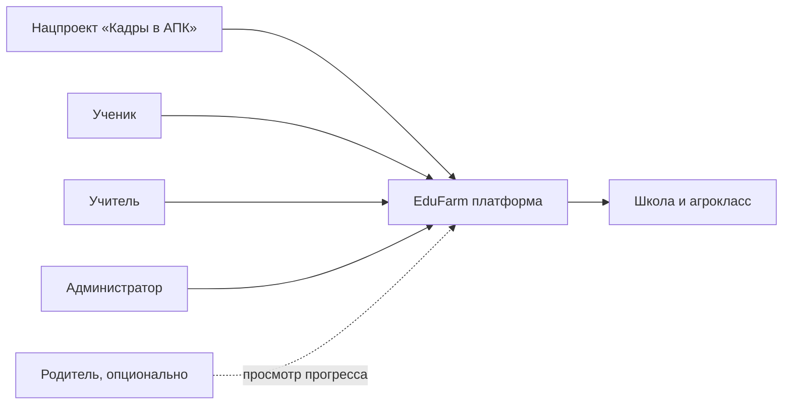

## 2) BPMN AS-IS (как обычно проходит обучение без модуля)
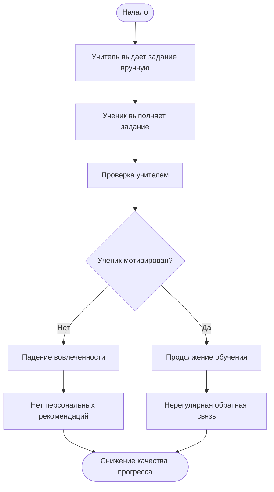

## 3) Use-Case диаграмма
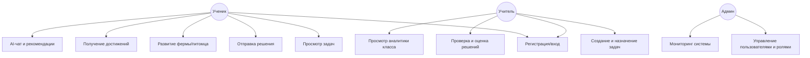

## 4) Главная архитектурная схема (C4 System Context)
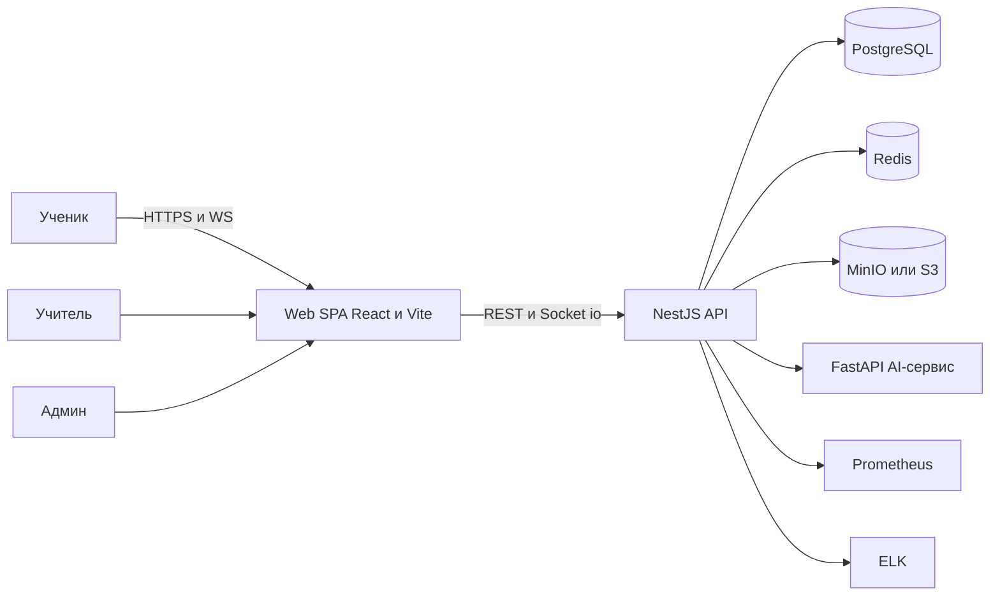

## 5) Контейнерная диаграмма (C4 Containers)
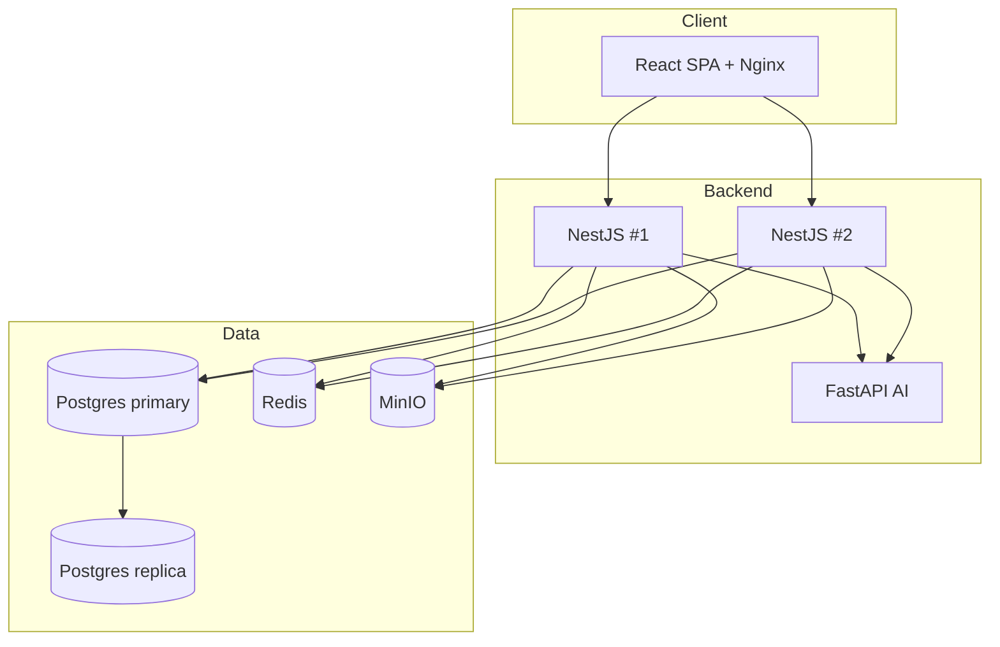

## 6) ER-диаграмма
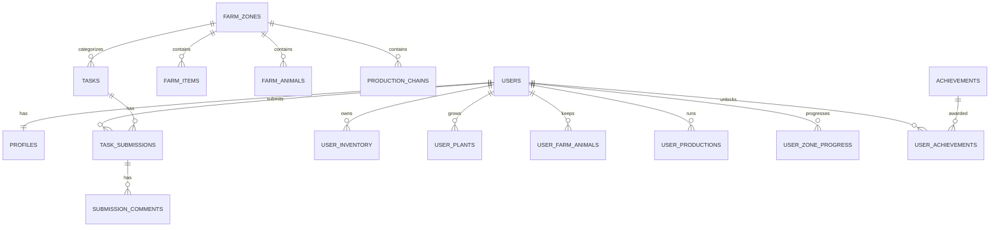

## 7) Sequence: авторизация
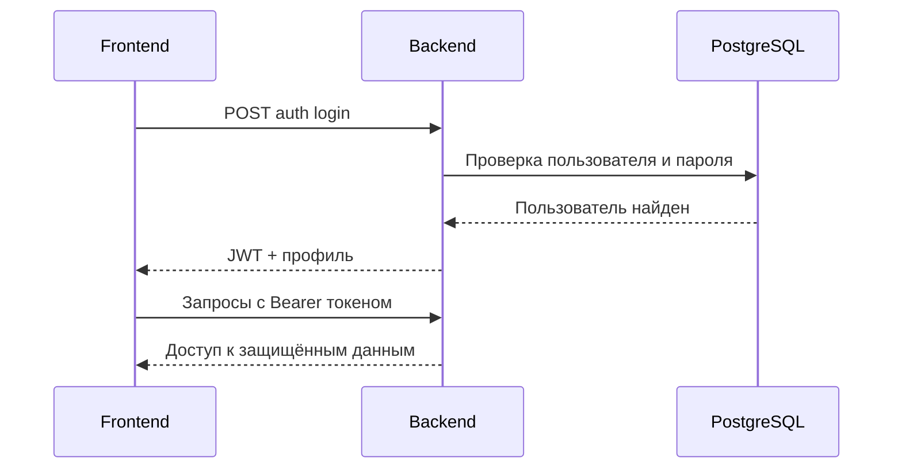

## 8) Sequence: AI-запрос
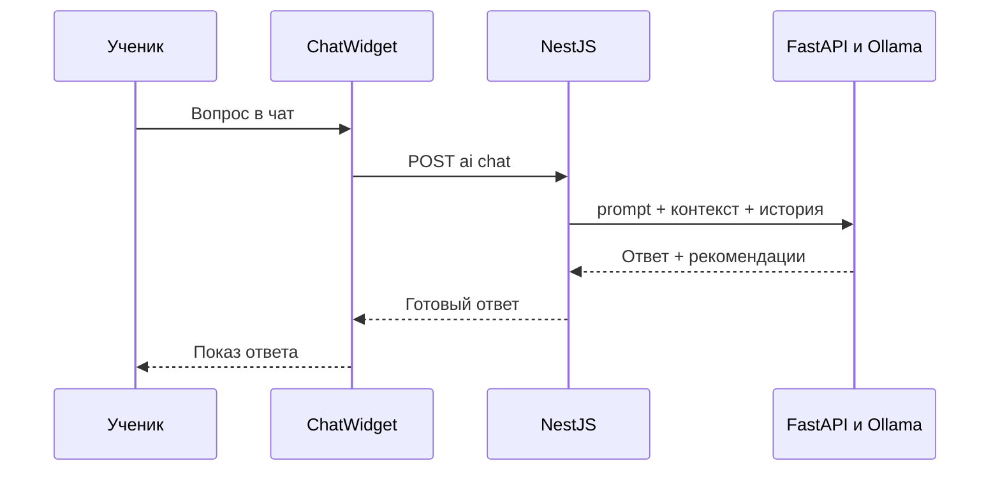

## 9) AI pipeline (обязательно для 2.4)
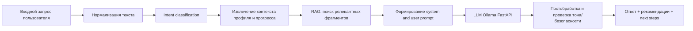

## 10) Пользовательский flow (UI)
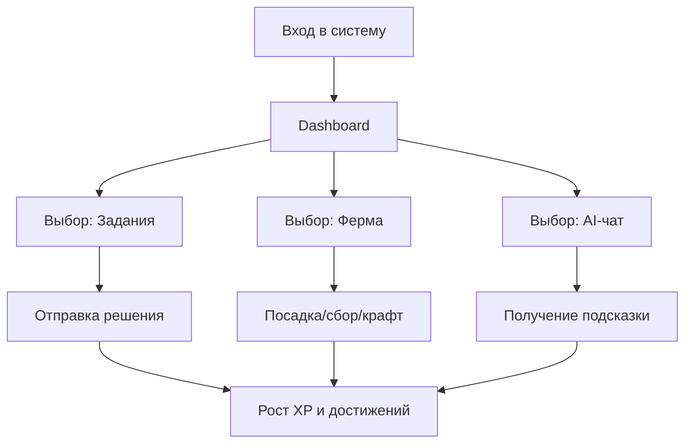

## 11) Диаграмма развертывания/наблюдаемости
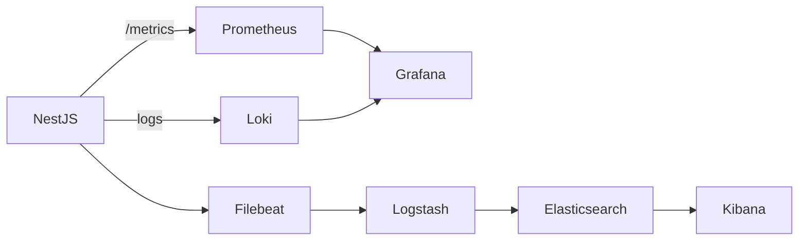
